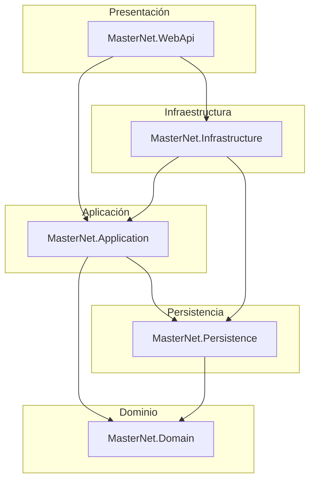
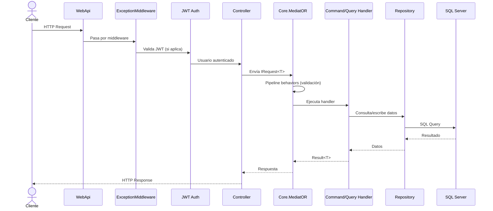
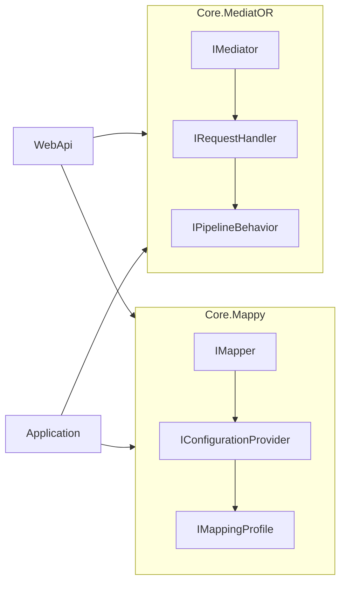
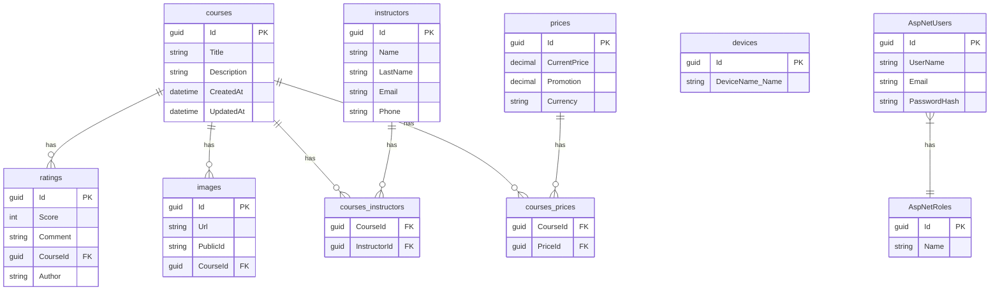
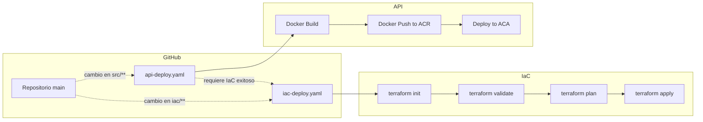
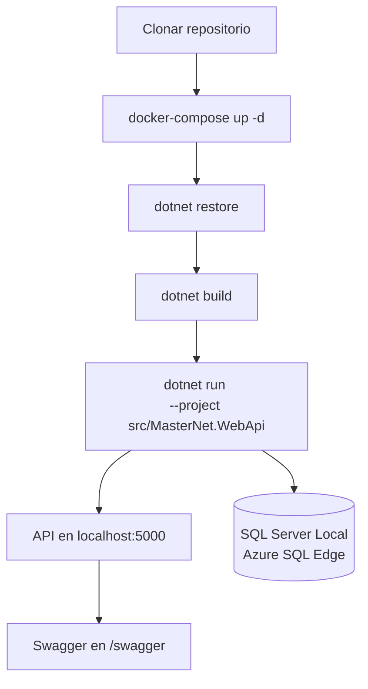
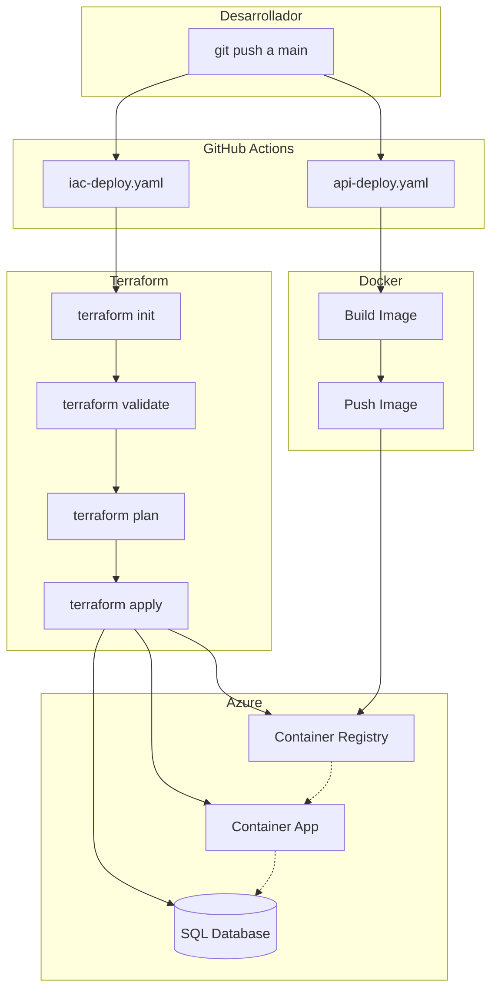

# MasterNet

Plataforma educativa en línea construida con **.NET 10** y **Arquitectura Limpia (DDD/CQRS)**, desplegada en **Microsoft Azure** mediante **Terraform** como Infraestructura como Código (IaC) y **GitHub Actions** para CI/CD.

---

## Arquitectura

El proyecto sigue los principios de **Clean Architecture** con 5 capas:



| Capa | Proyecto | Responsabilidad |
|------|----------|----------------|
| **Domain** | `MasterNet.Domain` | Entidades, Value Objects, Abstracciones (`BaseEntity`, `IGenericRepository`, `IUnitOfWork`, `ISpecification`) |
| **Application** | `MasterNet.Application` | Casos de uso CQRS (Commands/Queries), `Result<T>`, validaciones, interfaces de servicio |
| **Persistence** | `MasterNet.Persistence` | EF Core DbContext, repositorios, Unit of Work, migraciones, seed data |
| **Infrastructure** | `MasterNet.Infrastructure` | JWT Token Service, Cloudinary (fotos), reportes CSV, UserAccessor |
| **WebApi** | `MasterNet.WebApi` | Controladores REST, middleware de errores, OData, Health Checks |

### Flujo de una solicitud



### Librerías personalizadas



- **`Core.MediatOR`** — Implementación propia del patrón Mediator (CQRS) con soporte para pipeline behaviors
- **`Core.Mappy`** — Mapeador objeto-a-objeto propio con `ProjectTo<T>` para IQueryable

---

## Tecnologías

### Backend
- .NET 10 (SDK `10.0.100-rc.1`)
- ASP.NET Core Web API
- Entity Framework Core 10
- Microsoft.AspNetCore.Identity
- JWT Bearer Authentication
- OData (Microsoft.AspNetCore.OData 9.4.0)
- Swagger UI

### Base de datos
- Azure SQL Database (SQL Server)
- SQLite (para pruebas locales)

### Infraestructura en Azure

```mermaid
graph TD
    subgraph "Azure - East US"
        RG[Resource Group<br/>nu-masternet-dev-eus-rg]
        SQL[SQL Server<br/>nu-masternet-dev-eus-sqlserver-main]
        DB[(SQL Database<br/>nu-masternet-dev-eus-db)]
        ACR[Container Registry<br/>numasternet{env_id}eusacr]
        LAW[Log Analytics<br/>nu-masternet-{env_id}-eus-law]
        ACAE[Container App Environment<br/>nu-masternet-dev-eus-acae]
        ACA[Container App<br/>nu-masternet-dev-eus-aca]
    end

    subgraph "Azure Storage"
        STATE[(Terraform State<br/>nuiacdeveusac)]
    end

    RG --> SQL
    RG --> ACR
    RG --> LAW
    RG --> ACAE
    SQL --> DB
    ACAE --> ACA
    ACAE --> LAW
    ACA -.-> ACR
    ACA -.-> SQL
```

| Recurso | Nombre |
|---------|--------|
| Resource Group | `nu-masternet-dev-eus-rg` |
| SQL Server | `nu-masternet-dev-eus-sqlserver-main` |
| SQL Database | `nu-masternet-dev-eus-db` |
| Container Registry | `numasternet{env_id}eusacr` |
| Log Analytics | `nu-masternet-{env_id}-eus-law` |
| Container App Environment | `nu-masternet-dev-eus-acae` |
| Container App | `nu-masternet-dev-eus-aca` |

### DevOps
- Terraform (azurerm 4.47.0)
- GitHub Actions
- Docker / Docker Compose

---

## API Endpoints

### Cursos
| Método | Ruta | Auth |
|--------|------|------|
| GET | `/api/courses` | Anónimo (paginado) |
| GET | `/api/courses/{id}` | Anónimo |
| POST | `/api/courses` | `COURSE_WRITE` |
| PUT | `/api/courses/{id}` | `COURSE_UPDATE` |
| DELETE | `/api/courses/{id}` | `COURSE_DELETE` |
| GET | `/api/courses/report` | Anónimo (CSV) |

### Instructores
| Método | Ruta | Auth |
|--------|------|------|
| GET | `/api/instructors` | Anónimo |
| POST | `/api/instructors` | Anónimo |

### Precios y Ratings
| Método | Ruta | Auth |
|--------|------|------|
| GET | `/api/prices` | Anónimo |
| GET | `/api/ratings` | Anónimo |

### Cuenta
| Método | Ruta | Auth |
|--------|------|------|
| POST | `/api/account/login` | Anónimo |
| POST | `/api/account/register` | Anónimo |
| GET | `/api/account/me` | Autorizado |

### Dispositivos
| Método | Ruta | Auth |
|--------|------|------|
| GET | `/api/devices` | Anónimo |

### Reportes
| Método | Ruta | Auth |
|--------|------|------|
| GET | `/odata/courses` | Anónimo (OData) |

### Health Check
| Método | Ruta |
|--------|------|
| GET | `/health` |

---

## Roles y Políticas

### Roles
- **ADMIN** — Acceso completo a todas las políticas
- **CLIENT** — Solo lectura y ratings

### Policies (10)
`COURSE_READ`, `COURSE_WRITE`, `COURSE_UPDATE`, `COURSE_DELETE`, `COMMENT_READ`, `COMMENT_WRITE`, `COMMENT_UPDATE`, `COMMENT_DELETE`, `RATING_READ`, `RATING_WRITE`

---

## Seed Data

Al iniciar por primera vez, la aplicación:
1. Ejecuta migraciones automáticas
2. Crea los roles ADMIN y CLIENT
3. Crea usuarios de prueba:
   - `vaxidrez` (Admin) — `Password123$`
   - `johndoe` (Client) — `Password123$`
4. Carga datos desde archivos JSON en `src/MasterNet.Persistence/SeedData/`

---

## Base de Datos



### Tablas principales
- `courses`, `instructors`, `prices`, `ratings`, `images`
- `devices` (con Value Object `DeviceName`)
- `courses_instructors`, `courses_prices` (join many-to-many)
- `AspNetUsers`, `AspNetRoles`, `AspNetUserRoles`, `AspNetRoleClaims` (Identity)

---

## Infraestructura (Terraform)

Los archivos IaC están en el directorio `iac/`:

| Archivo | Propósito |
|---------|-----------|
| `setup.tf` | Provider, backend |
| `vars.tf` | Variables de entrada |
| `resource-group.tf` | Resource Group |
| `azure-sql-db.tf` | SQL Server + Database + Firewall |
| `azure-container-apps.tf` | Container App |
| `azure-container-app-env.tf` | Container App Environment |
| `acr.tf` | Container Registry |
| `azure-law.tf` | Log Analytics Workspace |

El estado de Terraform se almacena en Azure Storage (`nuiacdeveusac` / contenedor `terraform`).

---

## CI/CD (GitHub Actions)



### `iac-deploy.yaml`
- **Trigger:** Cambios en `iac/**` en la rama `main`
- **Flujo:** `init` → `validate` → `plan` → `apply`
- **Backend:** Azure Storage (`nuiacdeveusac`)

### `api-deploy.yaml`
- **Trigger:** Pushes a `main` (depende de IaC exitoso)
- **Flujo:** Build Docker → Push a ACR → Deploy a Container App

---

## Desarrollo Local

### Requisitos previos

| Herramienta | Versión | Propósito |
|-------------|---------|-----------|
| .NET SDK | `10.0.100-rc.1` | Compilación y ejecución |
| Docker Desktop | Última | SQL Server local (Azure SQL Edge) |
| Azure CLI | Última | Autenticación con Azure (opcional) |
| Terraform | >= 1.x | Infraestructura local (opcional) |

### Ejecutar en desarrollo



```bash
# 1. Clonar el repositorio
git clone <repo-url>
cd MasterNet

# 2. Iniciar SQL Server local con Docker Compose
#    Usa azure-sql-edge en puerto 1433
docker-compose up -d

# 3. Restaurar paquetes NuGet
dotnet restore

# 4. Compilar la solución
dotnet build

# 5. Iniciar la API (las migraciones se ejecutan automáticamente)
dotnet run --project src/MasterNet.WebApi
```

La API estará disponible en:
- **API:** `http://localhost:5000`
- **Swagger:** `http://localhost:5000/swagger`
- **Health Check:** `http://localhost:5000/health`

### Usuarios de prueba (seed data)

| Usuario | Rol | Contraseña |
|---------|-----|------------|
| `vaxidrez` | ADMIN | `Password123$` |
| `johndoe` | CLIENT | `Password123$` |

### Ejecutar con Docker

```bash
# Build de la imagen
docker build -f MasterNet.Dockerfile -t masternet-api .

# Ejecutar contenedor (requiere SQL Server configurado aparte)
docker run -p 8080:80 masternet-api
```

### Ejecutar pruebas

```bash
dotnet test tests/MasterNet.Application.UnitTests
```

---

## Despliegue a Producción

### Diagrama del Pipeline Completo



### Paso 1: Infraestructura con Terraform

```bash
# Navegar al directorio de IaC
cd iac

# Inicializar Terraform (configura el backend en Azure Storage)
terraform init

# Validar la configuración
terraform validate

# Ver el plan de cambios
terraform plan

# Aplicar la infraestructura en Azure
terraform apply -auto-approve
```

**Archivos de IaC:**

| Archivo | Recurso que crea |
|---------|-----------------|
| `setup.tf` | Provider y backend |
| `vars.tf` | Variables de entrada |
| `resource-group.tf` | Resource Group |
| `azure-sql-db.tf` | SQL Server + Database + Firewall Rule |
| `azure-container-apps.tf` | Container App |
| `azure-container-app-env.tf` | Container App Environment |
| `acr.tf` | Container Registry |
| `azure-law.tf` | Log Analytics Workspace |

### Paso 2: CI/CD Automático (GitHub Actions)

**Workflow IaC (`.github/workflows/iac-deploy.yaml`)**
- Se activa automáticamente al hacer push a `main` con cambios en `iac/`
- Ejecuta `init` → `validate` → `plan` → `apply`
- Aprovisiona/actualiza todos los recursos de Azure

**Workflow API (`.github/workflows/api-deploy.yaml`)**
- Se activa al hacer push a `main` con cambios en `src/`
- Construye la imagen Docker multi-stage
- La publica en Azure Container Registry (ACR)
- Despliega la nueva imagen en Azure Container App (ACA)
- La ACA se conecta a Azure SQL Database

### Paso 3: Verificar el despliegue

```bash
# Obtener la URL de la Container App
az containerapp show \
  --name nu-masternet-dev-eus-aca \
  --resource-group nu-masternet-dev-eus-rg \
  --query properties.configuration.ingress.fqdn

# Verificar health check
curl https://<fqdn>/health

# Probar login con usuario seed
curl -X POST https://<fqdn>/api/account/login \
  -H "Content-Type: application/json" \
  -d '{"email":"vaxidrez","password":"Password123$"}'
```

### Variables de entorno requeridas

| Variable | Descripción |
|----------|-------------|
| `ConnectionStrings__DefaultConnection` | Cadena de conexión a Azure SQL |
| `JwtSettings__Key` | Clave secreta para firmar JWT |
| `JwtSettings__Issuer` | Emisor del token JWT |
| `JwtSettings__Audience` | Audiencia del token JWT |
| `Cloudinary__CloudName` | Nombre del cloud en Cloudinary |
| `Cloudinary__ApiKey` | API Key de Cloudinary |
| `Cloudinary__ApiSecret` | API Secret de Cloudinary |

---

## Estructura del Proyecto

```
MasterNet/
├── .github/workflows/          # CI/CD pipelines
├── iac/                        # Terraform (IaC)
├── libs/
│   ├── Core.Mappy/             # Mapeador personalizado
│   └── Core.MediatOR/          # Mediator personalizado (CQRS)
├── src/
│   ├── MasterNet.Domain/       # Capa de dominio
│   ├── MasterNet.Application/  # Capa de aplicación
│   ├── MasterNet.Persistence/  # Capa de persistencia
│   ├── MasterNet.Infrastructure/ # Capa de infraestructura
│   └── MasterNet.WebApi/       # API REST
├── tests/
│   └── MasterNet.Application.UnitTests/
├── MasterNet.Dockerfile        # Docker multi-stage
├── docker-compose.yml          # SQL Server local
├── global.json                 # SDK version
└── MasterNet.sln               # Solución .NET
```

---

## Licencia

Este proyecto es con fines educativos como parte de un curso de Terraform.
